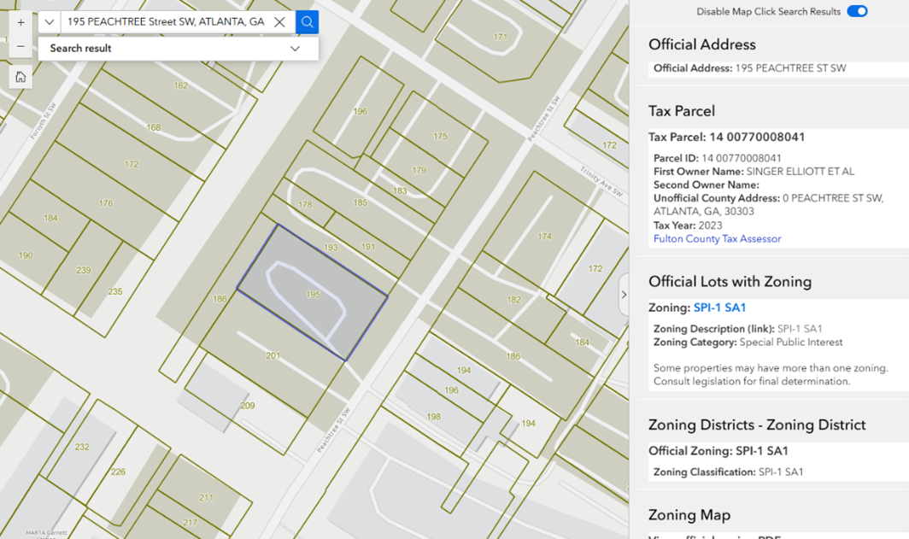

# Introduction

One of our most popular web map application relies heavily on the "Identify" widget from ArcGIS WebApp Builder. Since WebApp Builder will retire soon, it's necessary to re-build our old App with ArcGIS Experience Builder. The same functionality provided by "Identify" does not come with Experience Builder (at least at the time I write this). So the idea strikes us that we can use a custom widget ourselves.

The major part of the idea and the code for [this custom widget](https://community.esri.com/t5/experience-builder-custom-widgets/identify-for-experience-builder-1-14/tac-p/1594245#M232) is introduced by [@JeffreyThompson2](https://community.esri.com/t5/user/viewprofilepage/user-id/677423) from Esri community group of Experience Builder Custom Widgets. Shared as below, the two posts by Jeffery are really helpful for understanding the design logic of the widget.

- [Identify Widget from Mouse Click or Search Widget (First version of the custom Identify Widget)](https://community.esri.com/t5/experience-builder-custom-widgets/identify-widget-from-mouse-click-or-search-widget/tac-p/1596103#M234)
- [Identify for Experience Builder 1.14 (The updated Version)](https://community.esri.com/t5/experience-builder-custom-widgets/identify-for-experience-builder-1-14/ta-p/1480343)

<p align="center">
  
</p>

# Use this widget

ArcGIS Experience Builder Developer Edition is required. See documentation by Esri to establish the development environment [here](https://developers.arcgis.com/experience-builder/guide/install-guide/).

To add custom widgets to the development environment, copy and paste the widget folders to `./ArcGISExperienceBuilder/client/your-extensions/widgets`. (Read more [here](https://developers.arcgis.com/experience-builder/guide/getting-started-widget/))

It's important to mention that the "Identify" actually consists of two widgets: [identify-custom](https://github.com/weiliu-gis/exb-identify-widget/tree/master/identify-custom) and [search-sendToIdentify](https://github.com/weiliu-gis/exb-identify-widget/tree/master/search-sendToIdentify). So it's necessary to compile both widgets from `./ArcGISExperienceBuilder/client/your-extensions/widgets` by running `npm run build:prod` in the command window for client.

# Modifications

To make the re-built App look and function similarly to the old App, I modified the code in the following ways:

#### 1. Instead of showing feature layers' information in a tab view, a scrollable page view is applied.

The code that controls the layout of Identify's results is in `./identify-custom/src/components/results.tsx`. To keep the tab view, use:

```TypeScript
<Tabs
    fill
    type='underline'
    scrollable>
    {message ? message.map(div => {
        const markup = { __html: div.innerHTML }
        if (div.children[0]?.children[0].innerText) {
            return < Tab title={div.children[0]?.children[0].innerText} id={div.id} >
                <div dangerouslySetInnerHTML={markup}></div>
            </Tab>
        }
    }) : <></>}
</Tabs>
```

To switch to the scrollable page view, use:

```TypeScript
<div style={{ overflowY: 'auto', padding: '10px', border: '1px solid #ffffff' }}>
    {message ? message.map((div, index) => {
        const markup = { __html: div.innerHTML }
        // Check if the message content is empty
        if (!div.innerHTML.trim()) {
            return null;
        }

        return (
            <div key={index} style={{ marginBottom: '20px', paddingBottom: '10px', borderBottom: '1px solid #ffffff' }}>
                <div dangerouslySetInnerHTML={markup}></div>
            </div>
        )
    }) : <p>No results found.</p>}
</div>
```

#### 2. The updated Search Widget has basically the same functionality as in Jeffery's original code, but was re-developed based on ExB developer edition version 1.15 instead of 1.12. (I was not able to figure out why the older version is not working... Fortunately, it worked with v1.15)

Read [this post](https://community.esri.com/t5/experience-builder-custom-widgets/identify-widget-from-mouse-click-or-search-widget/tac-p/1596103#M234) to learn more about the custom Search Widget.

#### 3. Upon a "click" event, instead of highlighting all selected layers, only allow one layer to be highlighted.

In our scenario, it's better user experience to only highlight one specific layer when a user clicks somewhere in the map. So in `./identify-custom/src/components/identify.tsx`, the change has been made as:

```TypeScript
if (
    layerView.layer.type === "feature" &&
    typeof layerView.highlight === "function" &&
  layer.title === "TITLE_OF_LAYER_TO_BE_HIGHTLIGHTED" // Only allow highlighting the layer with this title
) {
    const newHighlight = handles.add(layerView.highlight(graphic));
    highlights.current.push(newHighlight);
    highlighted = true;
}
```

#### 4. Remove empty results from the Identify's result panel.

In `./identify-custom/src/components/results.tsx`:

```TypeScript
if (!div.innerHTML.trim()) {
    return null; // Skip rendering this popup if it's empty
}
```

# Limitation

The Search Widget delays the responses quite a bit on the layer source search requests. It works normally with locator source search attempts.
